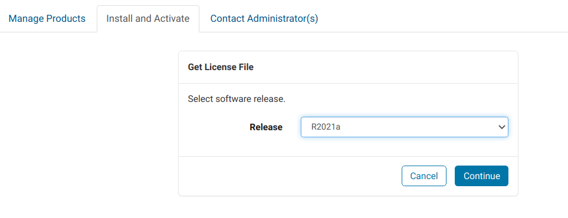

# Singularity recipe for Matlab

Singularity image of [Matlab](https://www.mathworks.com/) for high-performance computing (HPC).
- Matlab R2020a/R2021a
- Centos 7

### To build Matlab image from definition file:
1. Prereq: 
    - You need to be a MATLAB licensed user. As NUS Student, you can [register](https://www.mathworks.com/mwaccount/register) using NUS email.
    - You need to get the port of your netowrk license manager. (MLM_LICENSE_FILE=27000@172.18.174.18)

2. Get the File Installation Key
    - Select "Activate to Retrieve License File"
    
    - Click the download link under the Get License File heading, or click the "Activate Computer Button".
    
    - Select software version.
    
    - At the prompt “Is the software installed?” select “No”.
    
    - Copy and save the File Installation Key.
    

3. Get MATLAB Installer for Linux
    - Select "Download installer". 
    
    - Choose software version (should be the same version as chosen in step 2 above, because the installation key is version specific).
    
    - Choose "Linux", download the installer to your computer.
    

 4. Get MATLAB Installation Files (Reference: [Download without installing](https://www.mathworks.com/help/install/ug/download-without-installing.html))
    - Launch the installer. Sign in to your MathWorks Account and accept the MathWorks license agreement.
    
    - Select Advanced Options > I want to download without installing.
    
    - Select destination, platforms and products. (Note that at least 30 GB of free hard disk space is required for full products installation later.)
     
    - Complete the remaining steps and dowload the installation files to your `destination folder`.

5. Edit `installer_input.txt` (Reference: [Install Products Using File Installation Key](https://www.mathworks.com/help/install/ug/install-using-a-file-installation-key.html))
    - Go to your `destination folder` >   `installer_input.txt` file, edit and uncomment the following lines:
        - fileInstallationKey=`fileInstallationKey obtained in step 2 above`
        - agreeToLicense=yes

6. Build singularity image
    - Edit the definition file provided in this repo:
        - At `%setup`, replace `./MathWorks/R2020a_all` with the path to your installation files `destination folder` 
        -  Replace 27000@MyServerName with the port and location of your license manager. 
    - Build image:
        - `singularity build matlab.sif matlab.def`

7. Run container (in batch mode only)
    - `singularity run matlab.sif`: runs matlab in terminal
    - `singularity run matlab.sif MLM_LICENSE_FILE=27000@172.18.174.18`: to specify the network license manager. 
    - `singularity shell matlab.sif`: runs container in interactive terminal
    - `singularity exec matlab.sif matlab file.m`: runs the container with the script as input.

### Other references:
Dockerfile/images:
- https://hub.docker.com/r/mathworks/matlab
- https://github.com/mathworks-ref-arch/matlab-dockerfile

Licensing:
- https://www.mathworks.com/help/licensingoncloud/ug/configure-license-for-mathworks-containers.html

Supported compilers for simulink / other products:
(R2020a requireds gcc-6.3.0, R2021a requires gcc-7/8/9)
- https://www.mathworks.com/support/requirements/previous-releases.html
- https://www.mathworks.com/help/matlab/matlab_external/changing-default-compiler.html
- https://www.mathworks.com/matlabcentral/answers/454659-how-can-i-change-my-current-gcc-g-version-to-a-supported-one
- https://www.mathworks.com/help/matlab/matlab_external/change-default-gcc-compiler-on-linux-system.html
